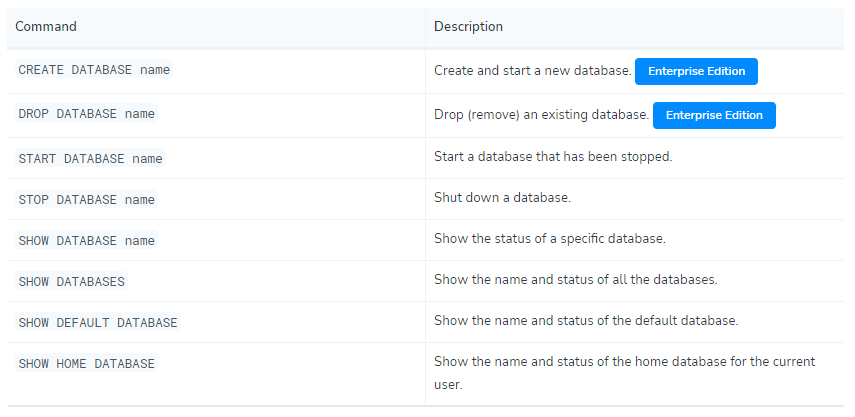

# Docker Neo4j

## create a neo4j docker container

```shell
docker run --name neo4j-test -p 7474:7474 -p 7687:7687 -d `
-v ${pwd}/mounted-volume/data:/data `
-v ${pwd}/mounted-volume/logs:/logs `
-v ${pwd}/mounted-volume/import:/var/lib/neo4j/import `
-v ${pwd}/mounted-volume/conf:/var/lib/neo4j/conf `
--env NEO4J_AUTH=neo4j/123456 `
--env NEO4J_ACCEPT_LICENSE_AGREEMENT=yes `
neo4j:enterprise
```

- first, you need to run an image with `enterprise` tag. only enterprise version support switch between database.
- second, you must use `neo4j` as login username if you create new container, not mounted any data volume.


## attach the neo4j container

```shell
docker exec -it neo4j-test /bin/sh
```

## use cypher to query data

```shell
cypher-shell -u neo4j -p 123456
```

then you can use cypher to operation your database.

> each query need end with `;`


