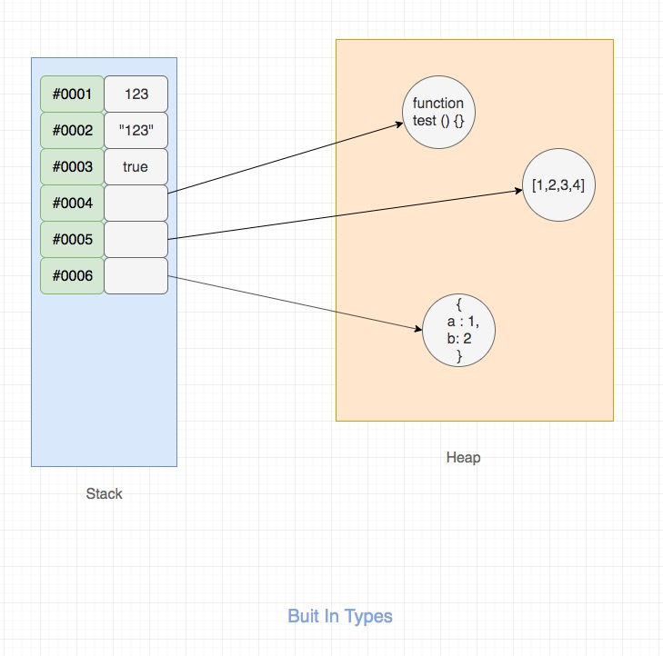
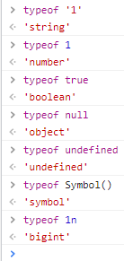
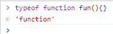

# Data Types

## JavaScript types

### types

* 7 primitive data types:
    * `string`
    * `number`
    * `boolean`
    * `null`
    * `undefined`
    * `symbol` ES6/ES 2015
    * `bigint` 第四阶段
* objects

1. a primitive (primitive value, primitive data type) is data that is not an `object` and has no methods.
2. All primitives are immutable. 类型是指值的类型，不是变量的类型，这是动态语言和静态语言的差异。原始类型的值是不可变的。变量是可以赋值为其他值的。
3. 原始类型有着固定的长度，会保存到栈上。而object是引用类型，会被分配到堆
   

### typeof




1. undefined is a primitive value automatically assigned to variables that have just been declared
    + 尝试访问未声明的变量会得到`Reference Error`，但是尝试`typeof`一个未声明的变量会得到`'undefined'`。
    + 所以typeof无法区分未声明还是未初始化。
2. `typeof something === 'undefined'`的三种情况：
    + something是一个未被声明的变量
    + something是一个声明了但是还未初始化的变量
    + something是一个赋值为`undefined`的变量
3. 在非全局作用域下你可以将undefined用作变量名（强烈不建议这么做），因为undefined是在全局作用域下的属性但不是关键字 While you can use undefined as an identifier
   (variable name) in any scope other than the global scope (because undefined is not a reserved word)

### number

The JavaScript Number type is
a [double-precision 64-bit binary format IEEE 754](https://en.wikipedia.org/wiki/Floating-point_arithmetic) value, like
double in Java or C#.

```js
function numbersCloseEnoughToEqual(n1, n2) {
    return Math.abs(n1 - n2) < Number.EPSILON;
}
```
