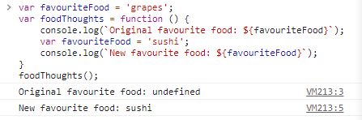

# Execution Context

## exercise hoist

声明提升是指对于var声明的变量，或者function声明的函数，在其作用域内，你可以在声明语句前调用它而不会报错。这是因为当运行到一个作用域时，js会先对作用域内var声明的变量和function声明的函数都分配内存地址。
但是var声明的变量分配的地址不会初始化，只有当运行到实际的声明语句才会对其初始化赋值。所以在声明语句前调用会返回undefined

## execution context

在浏览器环境下，当运行一个javascript文件，首先存在一个global execution context，他提供一个window对象和一个指向window的this。 在global execution
context下，先在creation phase阶段hoist所有var变量、function函数声明（重复的声明语句效果与赋值语句相同），然后进入execution phase阶段。

不止是global execution context是这样的，每次call a function，每个block都会创建一个属于自己的execution context，进行一遍creation phase和execution
phase。



## Implied Global Variables

if you assign a variable that never declared, it will be implied declared in the global scope.
> you better use `'use struct'` to prevent this weird unpredictable edge cases.

## special case

```js
var heyhey = function doodle() {
    doodle();// 'heyhey'
    return 'heyhey'
}
heyhey();// 'heyhey'
doodle();// ReferenceError
```

## Lexical Scope

in javascript our lexical scope(available data + variables where the function was defined) determines our available
variables. Not where the function is called(dynamic scope).
> except for the `this` keyword.

> you can use arrow function to make `this` depended on where it was defined.
